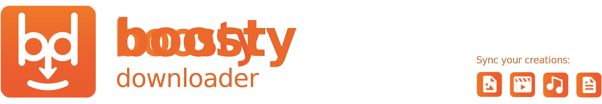

[](https://github.com/lowfc/boosty_downloader/releases)


---

## 🪄 Features

## 💻 Installation

## 🐍 Development

### Build the app

Run as a desktop app:

```
uv run flet run
```

Run as a web app:

```
uv run flet run --web
```

For more details on running the app, refer to the [Getting Started Guide](https://docs.flet.dev/).

### Build the app

**Android**

```
flet build apk -v
```

For more details on building and signing `.apk` or `.aab`, refer to the [Android Packaging Guide](https://docs.flet.dev/publish/android/).

**iOS**

```
flet build ipa -v
```

For more details on building and signing `.ipa`, refer to the [iOS Packaging Guide](https://docs.flet.dev/publish/ios/).

**macOS**

```
flet build macos -v
```

For more details on building macOS package, refer to the [macOS Packaging Guide](https://docs.flet.dev/publish/macos/).

**Linux**

```
flet build linux -v
```

For more details on building Linux package, refer to the [Linux Packaging Guide](https://docs.flet.dev/publish/linux/).

**Windows**

```
flet build windows -v
```

For more details on building Windows package, refer to the [Windows Packaging Guide](https://docs.flet.dev/publish/windows/).