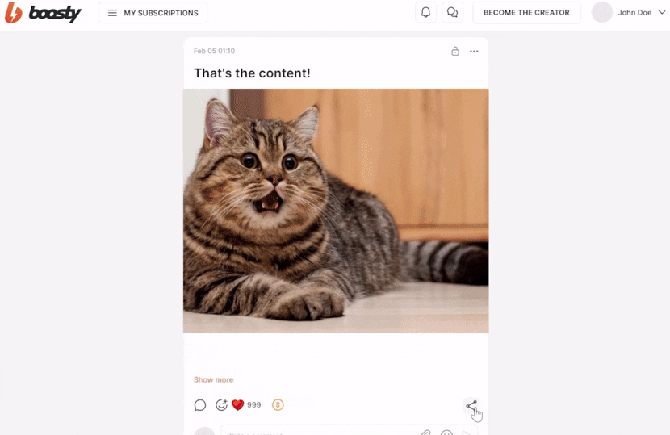

[](https://github.com/lowfc/boosty_downloader/releases)


---

Application for downloading content from boosty.to

## 👀 Demo



You can download content available to you according to your subscription level. 
To download restricted content, please log in.

By using the application, you agree to the <a href="https://github.com/lowfc/boosty_downloader/blob/develop/LICENSE.md">user agreement</a>.

## 🪄 Features

#### Download methods

- 🔗 Download post by link
- 📆 Download posts with a filter by publication date
- ✉️ Download image by link, including from personal messages

#### Supported content types

- 🖼️ Photos
- 📽️ Videos
- 🎧 Audios
- 📂 Attached files
- 📝 Post text and header

#### Supported operating systems

- ✅ Windows
- ⬜ Linux (coming soon)
- ⬜ macOS (coming soon)

#### Authorization ability

Authorize app to get available for you private content:


## 💻 Installation

#### Windows

1. Download the archive: <a href="https://github.com/lowfc/boosty_downloader/releases/download/3.0.0/Boosty Downloader 3.0.0 win.zip">Click here to download</a>
2. Unzip the archive to any folder 

⚠️ Important: the path to this folder must contain only latin characters. Make sure that the folder path does not contain cyrillic or other prohibited characters.

3. Run file boosty_downloader.exe

## 🐍 Development

### Run the app

Run as a desktop app:

```
uv run flet run
```

Run as a web app:

```
uv run flet run --web
```

For more details on running the app, refer to the [Getting Started Guide](https://docs.flet.dev/).

### Build the app

**Android**

```
flet build apk -v
```

For more details on building and signing `.apk` or `.aab`, refer to the [Android Packaging Guide](https://docs.flet.dev/publish/android/).

**iOS**

```
flet build ipa -v
```

For more details on building and signing `.ipa`, refer to the [iOS Packaging Guide](https://docs.flet.dev/publish/ios/).

**macOS**

```
flet build macos -v
```

For more details on building macOS package, refer to the [macOS Packaging Guide](https://docs.flet.dev/publish/macos/).

**Linux**

```
flet build linux -v
```

For more details on building Linux package, refer to the [Linux Packaging Guide](https://docs.flet.dev/publish/linux/).

**Windows**

```
flet build windows -v
```

For more details on building Windows package, refer to the [Windows Packaging Guide](https://docs.flet.dev/publish/windows/).